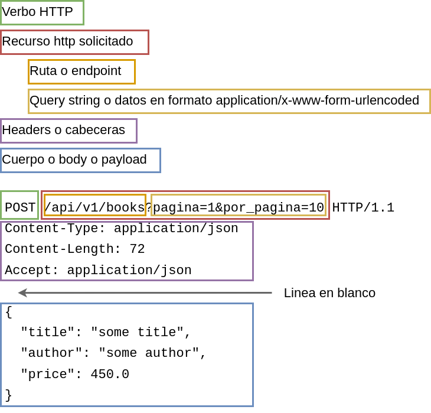

# Controladores

## Estructura de un controlador

Un controlador (@Controller) se encarga de atender las
peticiones HTTP y es una versión derivada de un componente
(@Component), cuando una clase se marca como controlador, los metodos de esa
clase que manejan una request deben responder con el nombre de una vista a
renderizar. Un controlador REST (@RestController) es una versión derivada de un
controlador (@Controller), la diferencia es que la respuesta de sus metodos
manejadores son el cuerpo de la respuesta HTTP (@ResponseBody).

Cuando se usa la anotación @Controller, el tipo de retorno de los metodos
manejadores (method handlers) debe ser un String que contiene el nombre de la
vista renderizar, por defecto se usa `JSP`, pero si se agrega la dependencia de
`Thymeleaf`, el ejemplo siguiente lo que hace es tomar el string `"file-name"`
y buscar en la ruta `src/main/java/resources/templates/` un archivo llamado
`file-name.html`:

```java
@Controller
@RequestMapping("/")
public class ClassName {
  @GetMapping("/index")
  public String getIndexPage() {
    return "file-name";
  }
}
```

En el caso de usar @RestController, lo que regresan los metodos de la clase es
lo que directamente se transforma en el cuerpo de la respuesta HTTP, si el tipo
de dato es un primitivo, directamente se regresa su representación en forma de
texto, en caso de un objeto no primitivo, se realiza una transformación al tipo
de contenido que se configura a responder en una api, ya sea JSON o XML
tipicamente:

```java
@RestController
@RequestMapping
public class ClassName {
  @Autowired
  UserService userService;
  @GetMapping("/users/length")
  public int getNumberOfUsers() {
    // si se devuelve un primitivo, el valor en texto sera devuelto directamente
    // en el cuerpo de la respuesta HTTP
    return this.userService.getUsers().length;
  }
  @GetMapping("/users/{id}")
  public User getUserById(@PathVariable int id) {
    // Cuando es un objeto no primitivo, se convierte automaticamente en una
    // estructura clave valor en base a los campos de clase: {"age": 25}
    return this.userService.getUserById(id);
  }
  @GetMapping("/users")
  public ArrayList<User> getBook(@PathVariable int id) {
    // Si es una coleccion de clases, automaticamente se genera un arreglo
    // con los elementos representados como clave valor: [{"age": 18}, {"age": 25}]
    return this.userService.getUsers();
  }
}
```

@RestController fue introducido en Spring 4.0 para 
simplificar la creacion de servicios web RESTful (es un anotacion
conveniente que combina @Controller y @ResponseBody, que elimina la necesidad
de anotar cada metodo de manejo de request con @ResponseBody).

Despues de clasificar a una clase con @RestController se debe indicar la ruta
base a partir de la cual todos los metodos de la clase usan, si no se
especifica, el valor es un string vacio que igual a la raiz de la ruta HTTP.

Este controlador usando @Controller:

```java
@Controller
@RequestMapping("books")
public class ClassName {
  @GetMapping("/{id}", produces = "application/json")
  public @ResponseBody Book getBook(@PathVariable int id) {
    return findBookById(id);
  }
}
```

Es equivalente a usar @RestController:

```java
@RestController
// @RequestMapping("ruta", produces = {MediaType.APPLICATION_JSON_VALUE})
@RequestMapping
public class ClassName {
  @GetMapping("/{id}", produces = "application/json")
  public Book getBook(@PathVariable int id) {
    return findBookById(id);
  }
}
```

## Estructura de una peticion HTTP



 - Los verbos HTTP se filtran a traves de las anotaciones que descienden de
 `@RequestMapping`. Como es `@GetMapping`, `@PostMapping`, `@PutMapping`,
 `@DeleteMapping` y `@PatchMapping`, una de estas anotaciones se agrega a un
 metodo, ese metodo es llamado **Method handler** (metodo manejador).

 - La ruta o endpoint se agrega como parametros de las anotaciones de tipo
 `@RequestMapping("<ruta o endpoint>")`.

 - El **Query String** se extrae en Spring a traves de los parametros del
 del method handler, por cada campo del query string, se agrega un parametro del
 tipo correspondiente y una anotación
 `@RequestParam(<nombre>, defaultValue=<valor>)` en la que se indica el nombre
 del parametro y un valor por defecto en caso de que el parametro este ausente
 en la url:
```java
@GetMapping("search")
public String getData(
  @RequestParam("pagina", defaultValue=1) int page,
  @RequestParam("por_pagina", defaultValue=10) int perPage
) {
  String formattedText = "Mostrando %d elementos de la pagina %d";
  return String.format(formattedText, perPage, page);
}
```
Si se quiere obtener todos los parametros en una sola variable, se puede
declarar un parametro de tipo `Map<String, String>` y la anotacion
`@RequestParam` sin especificar un identificador o nombre de parametro.
```java
@GetMapping("search")
public String getData(
  @RequestParam Map<String, String> params) {
  String formattedText = "Mostrando %d elementos de la pagina %d";
  return String.format(formattedText, params.get("per_page"), params.get("page"));
}
```

 - Los headers pueden accesarse igual que los parametros del query string, se
 usa la anotación `@RequestHeader(<nombre>)` en un parametro de tipo String,
 si el tipo es diferente de String se aplica una conversión automatica. Si no se
 especifica un nombre de header y el tipo de dato del parametro del metodo
 manejador es `Map<String, String>`, entonces el parametro recibe todos los
 headers en ese parametro. Hay un tipo especial de Header que guarda una lista
 de cookies, se puede accesar a cada cookie con la anotación
 `@CookieValue(<nombre>)`.

 - Para accesar al body de la petición, se debe anotar un parametro de **method handler** con la anotación `@ResponseBody` y spring leera el body
lo deserializara dentro de un objeto del tipo que se especifique en el
parametro. Si el body de la peticion es **multipart**, se puede usar la
anotación `@RequestPart(<nombre de parte>)`, se usa igual que response body.
Si se quiere leer un body o una parte como archivo, se puede especificar la
interface `MultipartFile` como tipo del parametro del method handler, esta
interface viene del paquete `org.springframework.web.multipart`. Si deseas
acceder a la lista de todos los archivos en un body multipart puedes anotar
un parametro con `@RequestParam` sin especificar un nombre en la anotación y
especificando `Map<String, MultipartFile>` como tipo del parametro.

## Mapeando metodos HTTP

En un controlador, la ruta y el metodo HTTP a escuchar se configura a tráves
de la anotación `@RequestMapping`, para mayor facilidad existen las siguientes
anotaciones, para los metodos HTTP más comunmente utilizados:

`@GetMapping, @PostMapping, @PutMapping, @DeleteMapping, @PatchMapping`

Estas anotaciones son creadas a partir de `@RequestMapping`, por ejemplo,
`@GetMapping` esta declarada así:

```
@RequestMapping(method=GET)
public @interface GetMapping
```

## Variables de ruta

```java
@GetMapping("ruta1/{name1}/{name2}")
public String getData(
  @PathVariable("name2") int age,
  @PathVariable("name1") String name
) {
  String formattedText = "La edad de %s es %d";
  return String.format(formattedText, name, age);
}
```

## Parametros HTTP

Los parametros HTTP son los variables que se pueden incluir al final de
una URL despues del signo `?`, ejemplo:
`https://www.google.com/search?q=spring+framework&sourceid=chrome`. Las
q y sourceid en Spring Boot se extraen con la anotacion `@ParamRequest`:

```java
@GetMapping("search")
public String getData(
  @RequestParam("q", defaultValue="Hello") String query,
  @RequestParam("sourceid", defaultValue="World") String browserName
) {
  String formattedText = "Buscando %s desde %s";
  return String.format(formattedText, query, browserName);
}
```

## Formato de solicitud HTTP

Una solicitud http tiene la siguiente estructura:

```
POST /api/v1/books HTTP/1.1
Content-Type: application/json
Content-Length: 72
Accept: application/json

{
  "title": "some title",
  "author": "some author",
  "price": 450.0
}
```

Comienza con una linea en donde se especifica el método HTTP, separado
con un espacio de la ruta a la que se hace la petición y de la versión del
protocolo HTTP que se esta usando.

Las siguientes lineas representan los `headers`, los headers se terminan
cuando hay una linea en blanco, despues de esa linea en blanco se encuentra
el cuerpo de la solicitud.

Para poder acceder al cuerpo de una solicitud en Spring se usa la anotación
`@RequestBody`, en base a los campos del json llena los campos del objeto que
coinciden en el nombre:

```java
@PostMapping("/books", produces = "application/json")
public Book addBook(@RequestBody Book book) {
  return addNewBook(book);
}
```

Usando la anotación @RequestBody solo se accede al cuerpo de la peticion, pero
para poder acceder a los headers y todos los datos de la peticion, se agrega
un parametro de tipo `HttpEntity<T>` donde T podemos especificar un tipo de dato
que esperamos leer del cuerpo de la petición, la siguiente petición es
equivalente a la aneterior, solo que ya se puede acceder a todos los datos de la
petición:

```java
@PostMapping("/books", produces = "application/json")
public Book addBook(HttpEntity<Book> entity) {
  entity.getHeaders();
  entity.hasBody();
  return addNewBook(entity.getBody(););
}
```

## Respuestas HTTP

Hay dos formas de crear una respuesta HTTP, una es devolviendo un tipo de dato
en el method handler que se convierte a un formato que pueda ser escrito en el
body, los headers y linea de inicio son generados automaticamente:

```java
@GetMapping("/books", produces = "application/json")
public Book getBooks() {
  return new Book();
}
```

La otra forma es devolver un tipo `ResponseEntity<T>` donde T es el tipo de
dato que sera escrito en el body de la respuesta HTTP. Con un objeto de tipo
ResponseEntity se puede controlar el codigo de estado de respuesta y los
headers:

```java
@RequestMapping("/handle")
public ResponseEntity<String> handle() {
  URI location = new URI();
  HttpHeaders responseHeaders = new HttpHeaders();
  responseHeaders.setLocation(location);
  responseHeaders.set("MyResponseHeader", "MyValue");
  return new ResponseEntity<String>("Hello World", responseHeaders, HttpStatus.CREATED);
}
```

## Consumiendo la API

Envio de datos desde un formulario:

```html
<!--
<form
    action="https://www.google.com"
    method="POST" // por defecto GET
    enctype="application/x-www-form-urlencoded" // valor por defecto
    enctype="text/plain"
    enctype="multipart/form-data">
-->
<form action="/books" method="post">
  <label for="title">Title:</label><br>
  <input type="text" id="title" name="title"><br>
  <label for="author">Author:</label><br>
  <input type="text" id="author" name="author"><br><br>
  <label for="price">Price:</label><br>
  <input type="text" id="price" name="price"><br><br>
  <input type="submit" value="Enviar">
</form>
```

Peticion HTTP desde javascript:

```javascript
function getBooks() {
  fetch("/books")
    .then(response => response.json())
    .then(books => console.log(books));
}
```

