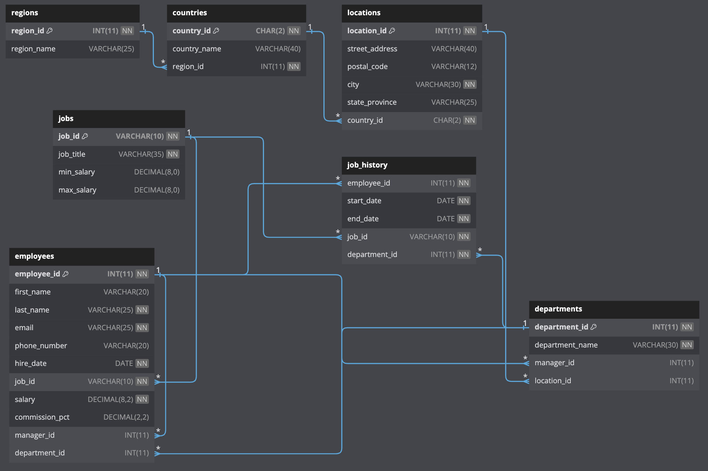

# SQL standard

## Estructura de una Query

```sql
SELECT DISTINCT column, AGG_FUNC(column_or_expression), …
FROM mytable
JOIN another_table
ON mytable.column = another_table.column
WHERE constraint_expression
GROUP BY column
HAVING constraint_expression
ORDER BY column ASC/DESC
LIMIT count OFFSET COUNT;
```

## Esquema usado

 - [MySQL Schema](https://raw.githubusercontent.com/mfs-luisortiz/mfs-luisortiz.github.io/master/sql/mysql-ddl.sql)
 - [SQLite Schema](https://raw.githubusercontent.com/mfs-luisortiz/mfs-luisortiz.github.io/master/sql/sqlite-ddl.sql)

<style>
p:has(img) {
  text-align: center;
}
</style>




<div class="container">
  <style>
    .container {
      display: flex;
      flex-wrap: wrap;
      justify-content: center;
      gap: 32px;
    }
    .sql-cell {
      /*color: #40916c;*/
    }
  </style>
<table>
  <style>
  </style>
  <thead>
    <tr><th style="padding-bottom: 0; font-weight: 300; text-align: center;" colspan="5">DESCRIBE job_history;</th></tr>
    <tr><th>Field</th><th>Type</th><th>Null</th><th>Key</th><th>Default</th><th>Extra</th></tr>
  </thead>
  <tbody>
    <tr>
      <td class="sql-cell">employee_id</td>
      <td class="sql-cell">int(11) unsigned</td>
      <td class="sql-cell">NO</td>
      <td class="sql-cell">PRI</td>
      <td class="sql-cell">null</td>
      <td class="sql-cell"></td>
    </tr>
    <tr>
      <td class="sql-cell">start_date</td>
      <td class="sql-cell">date</td>
      <td class="sql-cell">NO</td>
      <td class="sql-cell">PRI</td>
      <td class="sql-cell">null</td>
      <td class="sql-cell"></td>
    </tr>
    <tr>
      <td class="sql-cell">end_date</td>
      <td class="sql-cell">date</td>
      <td class="sql-cell">NO</td>
      <td class="sql-cell"></td>
      <td class="sql-cell">null</td>
      <td class="sql-cell"></td>
    </tr>
    <tr>
      <td class="sql-cell">job_id</td>
      <td class="sql-cell">varchar(10)</td>
      <td class="sql-cell">NO</td>
      <td class="sql-cell">MUL</td>
      <td class="sql-cell">null</td>
      <td class="sql-cell"></td>
    </tr>
    <tr>
      <td class="sql-cell">department_id</td>
      <td class="sql-cell">int(11) unsigned</td>
      <td class="sql-cell">NO</td>
      <td class="sql-cell">MUL</td>
      <td class="sql-cell">null</td>
      <td class="sql-cell"></td>
    </tr>
  </tbody>
</table>
<table>
  <style>
  </style>
  <thead>
    <tr><th style="padding-bottom: 0; font-weight: 300; text-align: center;" colspan="5">SELECT * FROM job_history;</th></tr>
    <tr><th>employee_id</th><th>start_date</th><th>end_date</th><th>job_id</th><th>department_id</th></tr>
  </thead>
  <tbody>
    <tr>
  <td class="sql-cell">101</td>
  <td class="sql-cell">110</td>
  <td class="sql-cell">1989-09-21</td>
  <td class="sql-cell">1993-10-27</td>
  <td class="sql-cell">AC_ACCOUNT</td>
</tr>
<tr>
  <td class="sql-cell">101</td>
  <td class="sql-cell">110</td>
  <td class="sql-cell">1993-10-28</td>
  <td class="sql-cell">1997-03-15</td>
  <td class="sql-cell">AC_MGR</td>
</tr>
<tr>
  <td class="sql-cell">102</td>
  <td class="sql-cell">60</td>
  <td class="sql-cell">1993-01-13</td>
  <td class="sql-cell">1998-07-24</td>
  <td class="sql-cell">IT_PROG</td>
</tr>
<tr>
  <td class="sql-cell">114</td>
  <td class="sql-cell">50</td>
  <td class="sql-cell">1998-03-24</td>
  <td class="sql-cell">1999-12-31</td>
  <td class="sql-cell">ST_CLERK</td>
</tr>
<tr>
  <td class="sql-cell">122</td>
  <td class="sql-cell">50</td>
  <td class="sql-cell">1999-01-01</td>
  <td class="sql-cell">1999-12-31</td>
  <td class="sql-cell">ST_CLERK</td>
</tr>
<tr>
  <td class="sql-cell">176</td>
  <td class="sql-cell">80</td>
  <td class="sql-cell">1998-03-24</td>
  <td class="sql-cell">1998-12-31</td>
  <td class="sql-cell">SA_REP</td>
</tr>
<tr>
  <td class="sql-cell">176</td>
  <td class="sql-cell">80</td>
  <td class="sql-cell">1999-01-01</td>
  <td class="sql-cell">1999-12-31</td>
  <td class="sql-cell">SA_MAN</td>
</tr>
<tr>
  <td class="sql-cell">200</td>
  <td class="sql-cell">90</td>
  <td class="sql-cell">1987-09-17</td>
  <td class="sql-cell">1993-06-17</td>
  <td class="sql-cell">AD_ASST</td>
</tr>
<tr>
  <td class="sql-cell">200</td>
  <td class="sql-cell">90</td>
  <td class="sql-cell">1994-07-01</td>
  <td class="sql-cell">1998-12-31</td>
  <td class="sql-cell">AC_ACCOUNT</td>
</tr>
<tr>
  <td class="sql-cell">201</td>
  <td class="sql-cell">20</td>
  <td class="sql-cell">1996-02-27</td>
  <td class="sql-cell">1999-12-19</td>
  <td class="sql-cell">MK_REP</td>
</tr>
  </tbody>
</table>
</div>

Se puede usar una variable como contador, al usar la expresion `*`, se debe especificar el nombre de la tabla
porque considera el nombre de la variable como el nombre de una columna si se coloca antes de la expresion `*`
(en SQLite se puede usar la funcion `row_number()`):

<div class="container">
<table>
  <thead>
    <tr><th style="padding-bottom: 0; font-weight: 300; text-align: left;" colspan="5">
        SET @rownum = 0;<br>SELECT @rownum := @rownum + 1 AS rownum, job_history.* FROM job_history;
    </th></tr>
    <tr><th>rownum</th><th>employee_id</th><th>start_date</th><th>end_date</th><th>job_id</th><th>department_id</th></tr>
  </thead>
  <tbody>
    <tr>
  <td class="sql-cell">1</td>
  <td class="sql-cell">101</td>
  <td class="sql-cell">110</td>
  <td class="sql-cell">1989-09-21</td>
  <td class="sql-cell">1993-10-27</td>
  <td class="sql-cell">AC_ACCOUNT</td>
</tr>
<tr>
  <td class="sql-cell">2</td>
  <td class="sql-cell">101</td>
  <td class="sql-cell">110</td>
  <td class="sql-cell">1993-10-28</td>
  <td class="sql-cell">1997-03-15</td>
  <td class="sql-cell">AC_MGR</td>
</tr>
<tr>
  <td class="sql-cell">3</td>
  <td class="sql-cell">102</td>
  <td class="sql-cell">60</td>
  <td class="sql-cell">1993-01-13</td>
  <td class="sql-cell">1998-07-24</td>
  <td class="sql-cell">IT_PROG</td>
</tr>
<tr>
  <td class="sql-cell">4</td>
  <td class="sql-cell">114</td>
  <td class="sql-cell">50</td>
  <td class="sql-cell">1998-03-24</td>
  <td class="sql-cell">1999-12-31</td>
  <td class="sql-cell">ST_CLERK</td>
</tr>
<tr>
  <td class="sql-cell">5</td>
  <td class="sql-cell">122</td>
  <td class="sql-cell">50</td>
  <td class="sql-cell">1999-01-01</td>
  <td class="sql-cell">1999-12-31</td>
  <td class="sql-cell">ST_CLERK</td>
</tr>
<tr>
  <td class="sql-cell">6</td>
  <td class="sql-cell">176</td>
  <td class="sql-cell">80</td>
  <td class="sql-cell">1998-03-24</td>
  <td class="sql-cell">1998-12-31</td>
  <td class="sql-cell">SA_REP</td>
</tr>
<tr>
  <td class="sql-cell">7</td>
  <td class="sql-cell">176</td>
  <td class="sql-cell">80</td>
  <td class="sql-cell">1999-01-01</td>
  <td class="sql-cell">1999-12-31</td>
  <td class="sql-cell">SA_MAN</td>
</tr>
<tr>
  <td class="sql-cell">8</td>
  <td class="sql-cell">200</td>
  <td class="sql-cell">90</td>
  <td class="sql-cell">1987-09-17</td>
  <td class="sql-cell">1993-06-17</td>
  <td class="sql-cell">AD_ASST</td>
</tr>
<tr>
  <td class="sql-cell">9</td>
  <td class="sql-cell">200</td>
  <td class="sql-cell">90</td>
  <td class="sql-cell">1994-07-01</td>
  <td class="sql-cell">1998-12-31</td>
  <td class="sql-cell">AC_ACCOUNT</td>
</tr>
<tr>
  <td class="sql-cell">10</td>
  <td class="sql-cell">201</td>
  <td class="sql-cell">20</td>
  <td class="sql-cell">1996-02-27</td>
  <td class="sql-cell">1999-12-19</td>
  <td class="sql-cell">MK_REP</td>
</tr>
  </tbody>
</table>
</div>

## Ejemplos de queries y salidas

```sql
SELECT 5; -- 5
SELECT 5 FROM DUAL; -- 5
SELECT 1 + 1; -- 2
SELECT TRUE = FALSE; -- 0
SELECT TRUE != FALSE; -- 1
SELECT NULL IS NULL; -- 1
SELECT NULL IS NOT NULL; -- 0
SELECT NULL = NULL; -- NULL
SELECT NULL != NULL; -- NULL
SELECT 'HOLA' WHERE NULL = NULL; -- SIN RESULTADOS
SELECT 15 BETWEEN 10 AND 20; -- 1
```

En manejo de strings puede haber mas diferencias entre motores de base de datos:

```sql
SELECT 'Foo' = 'foo'; -- MySQL(1), SQLite(0)
SELECT 'Foo' LIKE 'foo'; -- 1
SELECT 'Foo' COLLATE utf8mb4_bin = 'foo'; -- MySQL(0)
SELECT 'Foo' LIKE 'foo' COLLATE utf8mb4_bin; -- MySQL(0)
SELECT 'Foo' COLLATE NOCASE = 'foo'; -- SQLite(1)
SELECT 'Foo' = 'f%'; -- 0
SELECT 'Foo' LIKE 'f%%'; -- 1
SELECT 'Foobar%' LIKE 'foo%ar\%'; -- MySQL(1), SQLite(0)
SELECT 'Foobar' LIKE 'foo%ar'; -- 1
SELECT 'Foobar%' LIKE 'foo%ar|%' ESCAPE '|'; -- 1
SELECT 'a' REGEXP '[a-d]'; -- 1
```

Sobre obtener la longitud:

```sql
-- MySQL
SET @dolphin:='海豚';
SELECT LENGTH(@dolphin); -- 6
SELECT CHAR_LENGTH(@dolphin); -- 2
SELECT BIT_LENGTH(@dolphin); -- 48
SET @dolphin:='Foo';
SELECT LENGTH(@dolphin); -- 3
SELECT CHAR_LENGTH(@dolphin); -- 3
SELECT BIT_LENGTH(@dolphin); -- 24
-- SQLite
SELECT LENGTH('海豚'); -- 2
SELECT LENGTH('Foo'); -- 3
```

Manipulacion de Strings:

```sql
-- MySQL & SQLite
SELECT INSTR('foobarbar', 'bar'); -- 4
SELECT LOWER('FooBar'); -- foobar
SELECT UPPER('FooBar'); -- FOOBAR
SELECT TRIM('  barbar  '); -- "barbar"
SELECT RTRIM('  barbar  '); -- "  barbar"
SELECT LTRIM('  barbar  '); -- "barbar  "
SELECT REPLACE('www.mysql.com', 'w', 'Ww'); -- WwWwWw.mysql.com
SELECT SUBSTR('Quadratically',5); -- ratically
SELECT SUBSTR('Sakila', -5, 3); -- aki
-- MySQL
SELECT CONCAT('foo', 'bar'); -- foobar
SELECT INSERT('Quadratic', 3, 4, 'What'); -- QuWhattic
SELECT LEFT('foobarbar', 5); -- fooba
SELECT RIGHT('foobarbar', 5); -- arbar
SELECT LPAD('hi',4,'??'); -- ??hi
SELECT RPAD('hi',4,'??'); -- hi??
SELECT REPEAT('MySQL', 3); -- MySQLMySQLMySQL
SELECT REVERSE('abc'); -- cba
-- SQLite
SELECT "foo" || "bar"; -- foobar
```

Condicionales:

```sql
SELECT CASE region_id
    WHEN 1 THEN 'one' WHEN 2 THEN 'two' ELSE 'more' END
FROM regions; -- (one, two, more, more)
SELECT IFNULL(1,0); -- 1
SELECT IFNULL(NULL,10);; -- 10
 -- nullif(a,b): a != b return a | nullif(a,b): a == b return NULL
SELECT NULLIF(1,1); -- NULL
SELECT NULLIF(1,2); -- 1
SELECT COALESCE(NULL,NULL,NULL, 3); -- 3
SELECT 2 IN (0,3,5,7); -- 0
SELECT 'wefwf' IN ('wee','wefwf','weg'); -- 1
-- MySQL
SELECT IF(1<2,'yes','no'); -- yes
SELECT GREATEST(34.0,3.0,5.0,767.0); -- 767.0
SELECT LEAST(34.0,3.0,5.0,767.0); -- 3.0
-- SQLite
SELECT IIF(1<2,'yes','no'); -- yes
```

## Funciones de tiempo y de fechas

```sql
-- MySQL
SELECT CURDATE(), CURTIME(), NOW(), SYSDATE();
SELECT @@time_zone; -- SYSTEM -> UTC
SET @@time_zone = '-06:00'; -- HORA MEXICO
SELECT CURDATE(), CURTIME(), NOW(), SYSDATE();

-- Operaciones con fechas y tiempo
SELECT DATE_ADD('2018-05-02',INTERVAL 1 DAY); -- 2018-05-03
SELECT DATE_SUB('2018-05-02',INTERVAL 1 DAY); -- 2018-05-01
SELECT SUBDATE('2018-05-02',INTERVAL 1 DAY); -- 2018-05-01
SELECT SUBDATE('2008-01-02 12:00:00', 31); -- 2007-12-02 12:00:00
SELECT DATE_FORMAT('2009-10-04 22:23:00', '%W %M %Y'); -- Sunday October 2009
SELECT DATEDIFF('2007-12-31 23:59:59','2007-12-30'); -- 1
SELECT DAYNAME('2007-02-03'); -- Saturday
SELECT DAYOFMONTH('2007-02-03'); -- 3
SELECT DAYOFWEEK('2007-02-03'); -- 7
SELECT MONTH('2008-02-03'); -- 2
SELECT MONTHNAME('2008-02-03'); -- February
SELECT DAYOFYEAR('2007-02-03'); -- 34
SELECT EXTRACT(YEAR FROM '2019-07-02'); -- 2019
SELECT LAST_DAY('2003-02-05'); -- 28
SELECT WEEK('2008-12-31',1); -- 53
SELECT HOUR('10:05:03'); -- 10
SELECT MINUTE('2008-02-03 10:05:03'); -- 5
SELECT TIME('2003-12-31 01:02:03'); -- 01:02:03
SELECT TIMEDIFF('2000-01-01 00:00:00', '2000-01-01 00:00:00.000001'); -- -00:00:00.000001
SELECT SUBTIME('2007-12-31 23:59:59.999999','1 1:1:1.000002'); -- 2007-12-30 22:58:58.999997
SELECT ADDTIME('2007-12-31 23:59:59.999999', '1 1:1:1.000002'); -- 2008-01-02 01:01:01.000001
SELECT PERIOD_ADD(200801,2); -- 200803
SELECT PERIOD_DIFF(200802,200703); -- 11
SELECT STR_TO_DATE('01,5,2013','%d,%m,%Y'); -- 2013-05-01


-- SQLite
SELECT CURRENT_TIMESTAMP, CURRENT_DATE, CURRENT_TIME;

/* SQLite: solo 7 funciones
        -- date(time-value, modifier, modifier, ...)
        -- time(time-value, modifier, modifier, ...)
        -- datetime(time-value, modifier, modifier, ...)
        -- julianday(time-value, modifier, modifier, ...)
        -- unixepoch(time-value, modifier, modifier, ...)
        -- strftime(format, time-value, modifier, modifier, ...)
        -- timediff(time-value, time-value)
Como string se puede usar la palabra "now"
o sin argumentos, devuelve la fecha actual */
SELECT datetime('now'); -- 2023-11-11 09:25:46
SELECT date('now'); -- 2023-11-11
SELECT time('now'); -- 09:25:46
/* O con el siguiente formato:
        YYYY-MM-DD
        YYYY-MM-DD HH:MM
        YYYY-MM-DD HH:MM:SS
        YYYY-MM-DD HH:MM:SS.SSS
        YYYY-MM-DDTHH:MM
        YYYY-MM-DDTHH:MM:SS
        YYYY-MM-DDTHH:MM:SS.SSS
        HH:MM
        HH:MM:SS
        HH:MM:SS.SSS
        DDDDDDDDDD

Todas las funciones reciben un string de fecha, y le siguen N strings
"modificadores" que pueden modificar sumando o restando tiempo */

-- fecha actual, regresar al inicio del mes, sumar un mes y restar un dia
SELECT date('now','start of month','+1 month','-1 day')
-- los modificadores se pueden usar tambien para obtener la hora local y no en UTC
SELECT DATETIME('NOW'); -- 2023-11-11 09:56:40
SELECT DATETIME('NOW', 'LOCALTIME'); -- 2023-11-11 03:56:40
SELECT DATETIME('NOW', '-6 hours'); -- 2023-11-11 03:56:40 (hora mexico)
SELECT DATETIME('NOW', '-6 hour'); -- 2023-11-11 03:56:40 (hora mexico)
SELECT DATETIME('NOW', '-0 hours'); -- 2023-11-11 09:56:40 (UTC)
```

Procesando varias columnas y agrupando:

```sql
SELECT a,b,a*b as result;
SELECT
   *
FROM (
  SELECT 1 a,2 b UNION
  SELECT 3,4
) AS TEMP;
SELECT
   SUM(a), SUM(b), AVG(a), AVG(b)
FROM (
  SELECT 1 a,2 b UNION
  SELECT 3,4
) AS TEMP;
```
