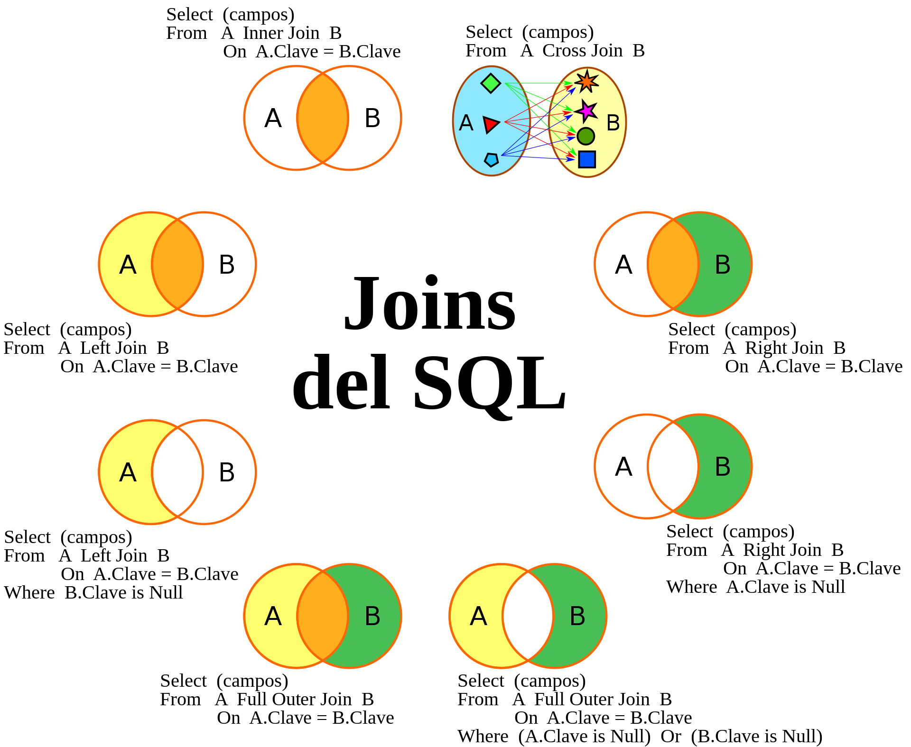

# SQL JOIN

## Tipos de JOIN

 - Equijoin
 - Nonequijoin
 - [Left|Right|full] outer join
 - self join
 - natural join
 - producto cartesiano

## Algoritmo que usa la operacion JOIN

Obtener la region a la que pertenece un pais:

  
<table>
  
  <thead>
    <tr><th style="padding-bottom: 0; font-weight: 300; text-align: center;" colspan="5">SELECT * FROM regions;</th></tr>
    <tr><th>region_id</th><th>region_name</th></tr>
  </thead>
  <tbody>
    <tr>
      <td class="sql-cell">1</td>
      <td class="sql-cell">America</td>
    </tr>
    <tr>
      <td class="sql-cell">2</td>
      <td class="sql-cell">Asia</td>
    </tr>
    <tr>
      <td class="sql-cell">3</td>
      <td class="sql-cell">Europe</td>
    </tr>
  </tbody>
</table>
<table>
  
  <thead>
    <tr><th style="padding-bottom: 0; font-weight: 300; text-align: center;" colspan="5">SELECT * FROM countries;</th></tr>
    <tr><th>country_id</th><th>country_name</th><th>region_id</th></tr>
  </thead>
  <tbody>
    <tr>
  <td class="sql-cell">1</td>
  <td class="sql-cell">Mexico</td>
  <td class="sql-cell">1</td>
</tr>
<tr>
  <td class="sql-cell">2</td>
  <td class="sql-cell">China</td>
  <td class="sql-cell">2</td>
</tr>
<tr>
  <td class="sql-cell">3</td>
  <td class="sql-cell">Spain</td>
  <td class="sql-cell">null</td>
</tr>
  </tbody>
</table>

Los motores de base de datos emplean una de 3 tecnicas que son las mas comunes para relizar un JOIN, Nested Loops,
Merge o Hash, la mas simple es Nested Loop que trata de cuando se quieren encontrar coincidencias de filas entre
2 tablas A y B, se requiere por cada fila A revisar cada fila de B para ver si no hay coincidencias, hay una o N
coincidencias:
